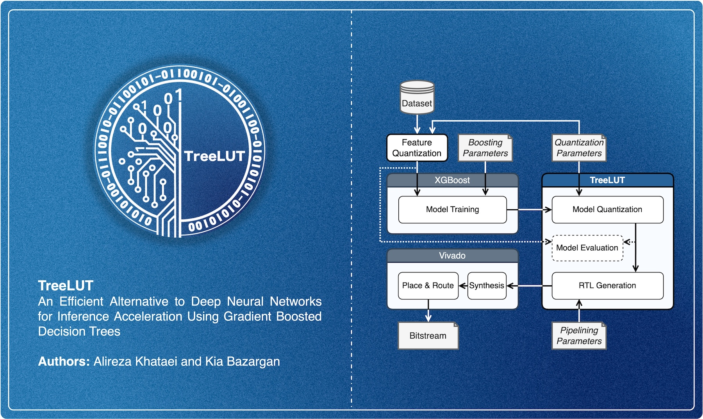

 ## TreeLUT


<div align="justify"> 
 
TreeLUT is a Python package for implementing gradient boosted decision trees (GBDTs) in hardware. It provides a tool to convert XGBoost models into Verilog files using an efficient quantization scheme, hardware architecture, and pipelining strategy. 

TreeLUT has been developed as a part of the following publication. The paper is availale on [ACM DL](https://doi.org/10.1145/3706628.3708877) and [arXiv](https://doi.org/10.48550/arXiv.2501.01511).

> Alireza Khataei and Kia Bazargan. 2025. TreeLUT: An Efficient Alternative to Deep Neural Networks for Inference Acceleration Using Gradient Boosted Decision Trees. In Proceedings of the 2025 ACM/SIGDA International Symposium on Field Programmable Gate Arrays (FPGA ’25), February 27-March 1, 2025, Monterey, CA, USA. ACM, New York, NY, USA, 11 pages.
  
## Installation
Use the following commands to clone the repository and install the package.

```bash
git clone https://github.com/kiabuzz/TreeLUT.git
cd TreeLUT
pip install .
```
    
## Getting Started
We have provided an [example](./example) in Jupyter Notebook to demonstrate how to use TreeLUT. As seen in the example, you need to take the following steps to implement a GBDT model in hardware. At each step, there are a few hyperparameters that you need to tune to achieve your target accuracy and performance.

__1. Data Quantization:__ As the first step, you must quantize the input features of your data into unsigned integers using *w_feature* bits, where *w_feature* is a hyperparameter. Some datasets are already quantized, such as MNIST in which the input features are 8-bit values. For other datasets, you might use a MinMax scaling and rounding function for the quantization.

__2. XGBoost Model Training:__ At this step, you need to train your GBDT model on the quantized data. There exist various libraries for GBDTs such as XGBoost, CatBoost, LightGBM, etc. However, the current version of TreeLUT only supports XGBoost classifiers. Each of these libraries supports a wide range of hyperparameters for training.

__3. TreeLUT Model Generation:__ After training the `XGBoostClassifier` module, you need to prepare it for hardware implementations. The `TreeLUTClassifier` class in our package facilitates the preparation and conversion of the model into hardware files. Below is an explanation of how to initialize the class and use its functions.

__3.1 Initialization__ 

The `TreeLUTClassifier` module needs the following parameters for initialization. 

* *xgb_model*: The primary XGBoost model already trained in Step 2. 
* *w_feature*: The bitwidth of the quantized data in Step 1. 
* *w_tree*: A hyperparameter that specifies the quantization bitwidth of the leaves of the XGBoost model.
* *pipeline* (optional): A hyperparameter that specifies the locations of pipeline stages in the hardware implementation. Please refer to Section 4.2 of the paper for more information.
* *dir_path* (optional): The direction of the folder in which the hardware files are generated.

__3.2 Functions__ 

* `convert()`: Quantizes the XGBoost model and converts it into the TreeLUT model. 
* `predict(X_test)`: Generates predictions for the given data.
* `verilog()`: Generates Verilog hardware files.
* `testbench(X_test, y_test)`: Generates Verilog testbench files.

## Citation
TreeLUT has been developed as a part of the following publication.

```bibtex
@inproceedings{treelut_fpga,
    author = {Khataei, Alireza and Bazargan, Kia},
    title = {TreeLUT: An Efficient Alternative to Deep Neural Networks for Inference Acceleration Using Gradient Boosted Decision Trees},
    year = {2025},
    booktitle = {Proceedings of the 2025 ACM/SIGDA International Symposium on Field Programmable Gate Arrays},
    numpages = {11},
    location = {Monterey, CA, USA},
    series = {FPGA '25}
}
```

> Alireza Khataei and Kia Bazargan. 2025. TreeLUT: An Efficient Alternative to Deep Neural Networks for Inference Acceleration Using Gradient Boosted Decision Trees. In Proceedings of the 2025 ACM/SIGDA International Symposium on Field Programmable Gate Arrays (FPGA ’25), February 27-March 1, 2025, Monterey, CA, USA. ACM, New York, NY, USA, 11 pages.

</div>
